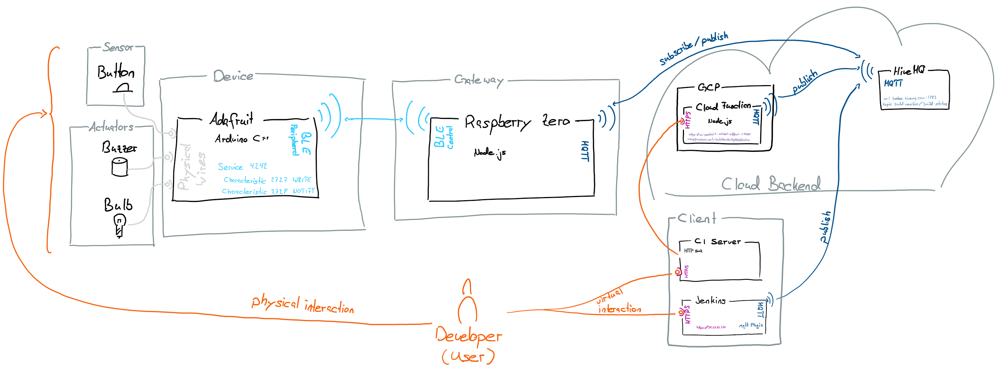

# Build Monitor

## Introduction
This project supports developers in determining whether their build jobs succeed or fail. The goal is to make build success and failure visible and audible so that developers don't have to monitor the ci server themselves.

## Use Cases
### Reference Model
The reference model of the ecosystem (including a sample Jenkins CI server) looks like the following:

The use cases were structured like the following:
1) Build failure notification: Whenever the build fails, the users get notified
2) Build success notification: Whenever the build succeeds from a previous failure, the users get notified
3) Commit fixing: Whenever a user commits himself to fix a broken build, the other users get notified

### Build Failure Notification
When a build fails, the users are notified. Notification means that an LED starts blinking red and blue and that a buzzer starts bleeping.
Technically the build server either triggers an event that publishes a code via an mqtt topic or the build server itself (if supported) publishes a code via an mqtt topic. The raspberry zero listens to that topic and sends the messages via BLE to the Adafruit which then signals the actuators.

### Build Success Notification
When the last build failed and succeeds again, users should be notified that the build is green again. The notification will disable the buzzer from bleeping and turn the LED to a constant green.

### Commit Fixing
When the build failed a user can push the physical button (attached to the Adafruit) to commit that he/she fixes the build. His/her LED will start blinking yellow and orange. Other peoples LEDs will start blinking in two different purple tones. This helps distributed teams to realize that someone takes over responsibility to fixing a failing build.

## Used Protocols and Technology

### Hardware
* [Adafruit](https://github.com/tamberg/fhnw-iot/wiki/Feather-nRF52840-Express)
* [Grove Shield](https://github.com/tamberg/fhnw-iot/wiki/Grove-Adapters#grove-shield-for-feather)
* [Button](https://github.com/tamberg/fhnw-iot/wiki/Grove-Sensors#button)
* [Buzzer](https://github.com/tamberg/fhnw-iot/wiki/Grove-Actuators#buzzer)
* [Chainable LED](https://github.com/tamberg/fhnw-iot/wiki/Grove-Actuators#chainable-rgb-led)
* [Raspberry Pi Zero W](https://github.com/tamberg/fhnw-iot/wiki/Raspberry-Pi-Zero-W)

### Software:
Technology  | Endpoints | Values
----------- | --------- | ------
Wires | Adafruit, LED, buzzer, Button | HIGH and LOW, different colors
BLE         | Service 4242, Characteristic 2727 for WRITE to peripheral | `00` for build success, `01` for build failure, `02` for someone else fixes build
BLE         | Service 4242, Characteristic 2728 for NOTIFY from peripheral | `00` for no committment, `01` for fixing committment
mqtt        | broker: mqtt://broker.hivemq.com, topic: build-monitor/build-status | `00` for build success, `01` for build failure, `02` for some committed fixing
http        | https://us-central1-elated-effect-240820.cloudfunctions.net/buildMonitorMqttNotification | POST Request with payload `success` for build success, `failed` for failure
